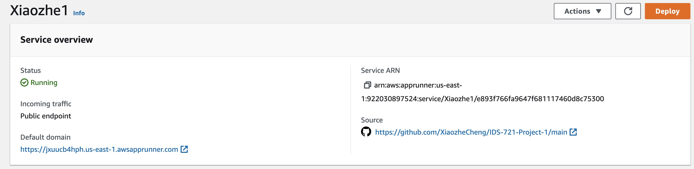
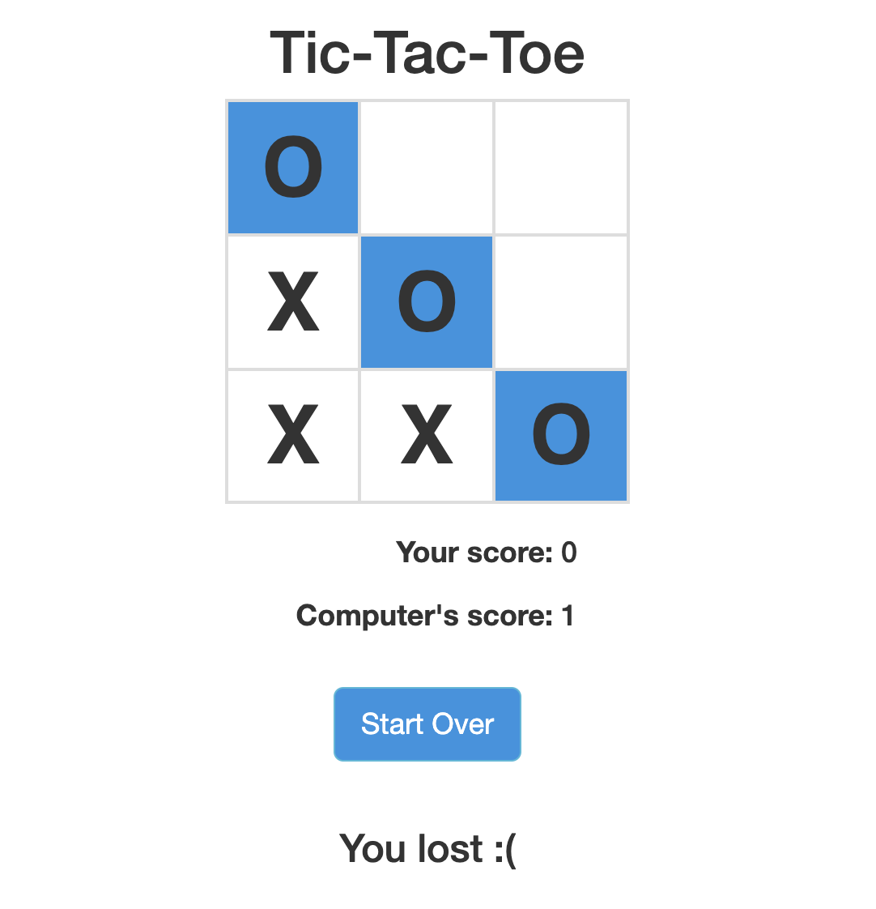

# Mini Game 
Mini tic-tac-toe game using Flask framework .  AI uses the minimax algorithm to calculate moves.

## Install
```
pip install -r requirements.txt
```

## Run
```
python tictactoe.py
```

and navigate to `http://localhost:5000` then upload to aws.
You can [play](https://jxuucb4hph.us-east-1.awsapprunner.com) here.

## Minimax
Inside [game.py](https://github.com/XiaozheCheng/IDS-721-Project-1/blob/main/game.py) 
is my implementation of the 
[minimax](https://en.wikipedia.org/wiki/Minimax) algorithm.




